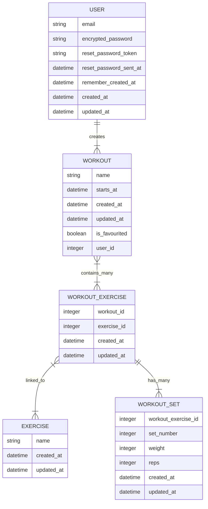

# Gym Track

## ERD



## FlowCharts

### User create workout
```mermaid
graph TD
  %%Initialize User and ensure they have an account
  start([Start]) -->|Get User| user_sign_in_check{User is signed in?}
  user_sign_in_check --> |No| sign_in_page(Redirect to sign in page)
  user_sign_in_check --> |Yes| user_home_page(Redirect to User home page)
  user_home_page --> retrieve_workouts(Retrieve all user's workouts from database)

  %%Check database if workout exists
  retrieve_workouts-->check_workout_existence{Workout Exists?}

  %%If Workout exists
  check_workout_existence--> |Yes| update_or_clone_choice{Update Workout or Clone?}
  update_or_clone_choice --> update(Update Workout)
  update --> save_to_database(Save to Database)
  update_or_clone_choice --> clone(Clone Workout)
  clone --> save_to_database

  %%If Workout doesn't exist
  check_workout_existence --> |No| new_workout(New Workout)
  new_workout-->check_title_input(User inputs title?)
  check_title_input-->|Yes|save_to_database
  check_title_input-->|No|error_response[/Send Turbo_Stream error response/]
  ```
